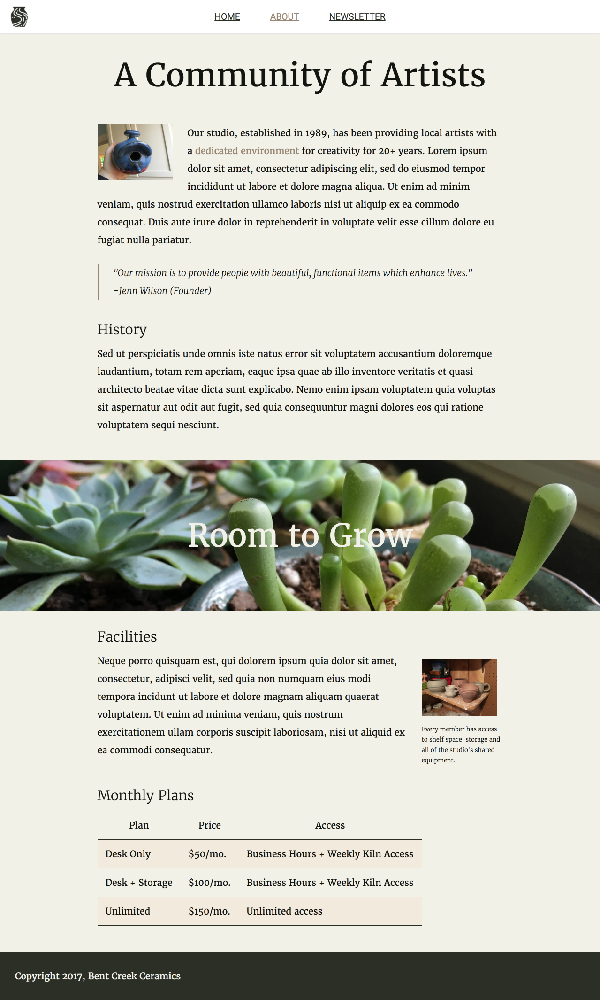
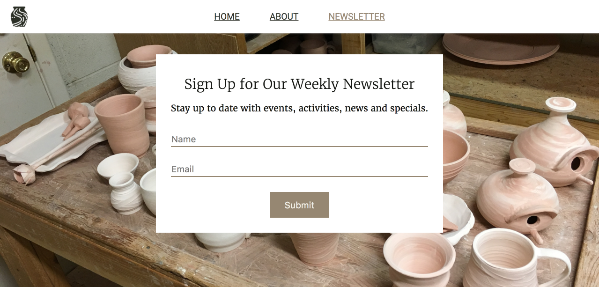

# Website Design - Bent Creek Ceramics
- Fictional company, Bent Creek Ceramics, provides mockups for a three-page website
- The site has a main, about, and newsletter page

---

# Heroku Link for Deployed Site
- [Bent Creek Ceramics](https://secret-dawn-47749.herokuapp.com/index.html)

---

# Design Considerations

## Elements Common to each page
- Navigation bar provides easy access to all three pages with logo in upper left
- Footer contains a simple copyright notice

## Main Page
- The main page displays the company logo and an image gallery displaying their work.
- Design details of the image gallery
  - Seven images with captions
  - Flexbox is used to arrange and size the images
  

## About Page

## Newsletter Page

